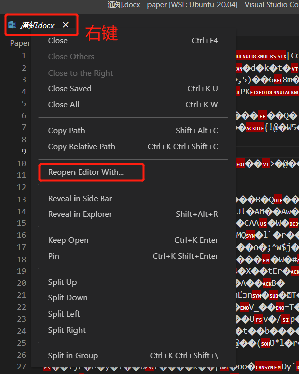
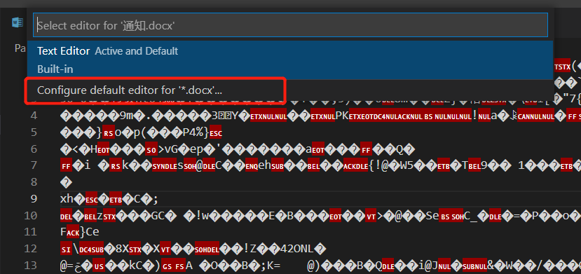

# 配置某个文件类型的默认打开方式

当以文本文件打开时，右下角会出现语言类型，比如`python,C++`等，但是这里不要管（点了之后会让你确定语言类型，但是如果想要打开一个vscode没有预置的语言类型——比如pdf——时，在这里是加不了的）

需要做的是

* 在打开的文本标签（也就是上方的tab，不是编辑的界面）处进行右键
* 这时在弹出的选项中选择`reopen editor with`，这时会进入选择用什么插件打开这个文件。如果下载的有插件，会显示在这里，但是**不要点插件**，因为如果在这里点了的话，只是这一次打开，之后还是无法正常使用插件打开，需要点击最下面的`config default editor for xxx`
* 在新弹出来的界面下选择就可以了
